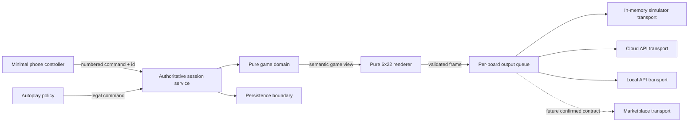

# VestaQuest implementation plan

Status: Slice 3 implementation; Gate B resolved with physical Wave/Fast validation

Last updated: 2026-08-09

Target hardware: Vestaboard Flagship, 6 rows by 22 columns

## 1. Purpose

VestaQuest is a short, solo dungeon-crawling RPG performed on a physical Vestaboard. The board is the shared theatrical display for everyone in the room; a phone is a deliberately small controller that submits the numbered choice currently shown on the board.

The first product goal is a complete private version that the owner can run without Vestaboard+. The later product goal is a curated Vestaboard+ Marketplace release, subject to Vestaboard confirming its current third-party installation, authentication, input, and game-session APIs.

This plan turns the confirmed design in `AGENTS.md` into small, testable delivery slices. It does not freeze unresolved balance values or marketplace assumptions.

## 2. Product north star

A successful run should feel like a strange mechanical object in the room is running a dungeon for the people gathered around it:

- The board makes every important reveal: maps, choices, enemies, dice, damage, treasure, level-ups, escape, and death.
- The controller normally shows only the legal numbered inputs and connection/session status.
- Every board update earns the noise, delay, and physical wear it causes.
- Runs are short enough to finish in one sitting, targeting roughly ten meaningful locations on the successful path.
- The objective is always to find and escape through the exit, but classes, discoveries, equipment, and decisions create different routes through that objective.
- Failure erases the run. What persists is player knowledge, plus a possible Lost Soul echo whose exact rules remain a later decision.

## 3. Release definitions

### Private playable alpha

One owner can start and finish a deterministic VestaQuest run through a local mobile web controller, with either a simulated board or the owner's Flagship as output. It includes all three classes, exploration, automatic advancement, basic equipment, at least one class-biased event per class, combat, an exit challenge, victory, and the six-row death epitaph. Credentials remain server-side, and Vestaboard+ is not required.

### Private content beta

The private alpha is expanded into a replayable, balanced short game with the initial enemy and event roster, authored or hybrid map variety, class actions, Wizard scroll affinities, robust recovery, accessibility checks, and deliberate physical-board pacing.

### Marketplace candidate

The content beta is adapted to Vestaboard's confirmed current marketplace contract. This is a separate release track, not an assumption built into the private version. No work will target the deprecated Subscription API unless Vestaboard explicitly directs us to it.

### Post-MVP experiment

Autoplay/watch mode uses the same game engine and legal-command interface as human play. It is not required for the first complete human-playable run.

## 4. Confirmed design baseline

The detailed canonical requirements live in `AGENTS.md`. The implementation plan assumes these central choices are settled unless the owner revises them:

- Title: **VestaQuest**, with `A VESTABOARD RPG` on the title screen.
- Solo character: Warrior, Rogue, or Wizard.
- Shared stats: HP, Power, Defense, Skill, and Luck.
- Compact slots: weapon, armor, consumable; Wizard also has a small scroll pouch.
- Navigation moves between meaningful rooms, not corridor animation frames.
- Available cardinal directions are visible; the nature of an unexplored room is not.
- Core resolution uses visible opposed D6 rolls.
- Combat menu: Attack, class action, Item, Run.
- Warrior: once-per-enemy Smash, roll 2D6 and keep the higher die.
- Rogue: once-per-enemy Steal, with an Unaware bonus before the enemy's first action.
- Wizard: single-use Fireball, Lightning, and Stun scrolls with readable enemy affinities.
- HP is shown physically as healthy white tiles and lost red tiles, with a textual or positional redundancy where needed.
- Automatic level-ups; no point-allocation screen.
- Dark, terse, mostly straight dungeon fiction.
- Death ends the run and displays cause, class, rooms found, enemies slain, and graph distance to the exit.

## 5. Decision gates

Decision gates prevent an unconfirmed preference from becoming an expensive architectural commitment. A gate may be resolved in a short design conversation, an Architecture Decision Record, or a measured prototype.

### Gate A — implementation stack, resolved 2026-08-09

Selected engineering stack:

- Node.js 22 LTS and strict TypeScript throughout.
- npm workspaces with `apps/server`, `apps/web`, and small shared packages.
- React plus Vite for the controller and local board simulator.
- Fastify for the long-running session server and per-board output worker.
- Vitest for unit/integration tests and Playwright for browser flows.
- SQLite behind a persistence interface for private mode; defer hosted-database selection until the marketplace contract is known.
- Zod or an equivalent runtime-schema library at API and persistence boundaries.

Why this shape: a long-running server suits authoritative sessions, credential custody, queues, and LAN/cloud adapters better than a serverless-first framework. TypeScript allows the domain, renderer, server, and web client to share command/view contracts without sharing secret-bearing transport code. The workspace boundaries remain deployable without turning the early project into many independently versioned services.

The stack is an engineering decision based on the platform constraints; the owner is not expected to choose framework plumbing. Slice 1 pins Node 22.23.1 for development/CI and TypeScript 6.0.x for compatibility with the current typed linting toolchain. Fastify and SQLite will be added only when the authoritative session slice needs them.

### Gate B — signature physical transition, resolved 2026-08-09

Decision: use the Cloud API's `wave` transition at `fast` speed for opposed-roll scaffold/result sequences. The application must read the owner's current transition preference, apply Wave/Fast only for the reveal, and restore the original preference afterward.

Physical findings:

- Classic/Gentle kept unchanged cells still but introduced the roll tiles, result numbers, and verdict effectively together.
- Wave/Gentle produced the intended left-to-right spatial order but felt too slow.
- Wave/Fast preserved that order at an acceptable pace and was accepted by the owner for the current design.
- Wave intentionally moves more flaps than Classic. The documented Cloud API does not offer a changed-cells-only, left-to-right hybrid.
- Local API `column` remains worth testing later for per-message control, but it is not an MVP blocker and must not be assumed to preserve unchanged cells until physically verified.

The physical Flagship was tested successfully through the Cloud API with Quiet Hours respected and the prior transition preference restored. Separate Digital Flagship validation remains useful for integration checks but is no longer a blocker for the transition-design decision.

Original experiment definition:

Prototype the two-state initiative reveal on:

1. the local deterministic simulator;
2. Vestaboard's official Digital Flagship;
3. the physical Flagship through the Cloud API;
4. the Local API if enabled.

Measure whether a single final write can keep scaffold cells still while revealing the white roll track, result, and right-positioned winner from left to right. Record video or written observations for Classic, Wave, and the relevant Local API column transition.

Fallback order if the ideal effect is unavailable:

1. Preserve the two-state opposed-roll composition and accept extra movement from Wave.
2. Use Classic so only changed cells move, accepting a less ordered reveal.
3. Redesign spatial placement so the natural transition order creates the intended suspense.

Do not implement per-tile network writes; the Cloud cadence makes that both slow and wasteful.

### Gate C — map grammar, before producing map content

Prototype at least three exact 6x22 exploration layouts and choose:

- grid dimensions and placement;
- whether a logical map cell is one flap or a visually stronger two-flap cell;
- HUD placement for HP/stats and available directions;
- current, explored, frontier, encounter, and dead-end symbols/colors;
- a non-color-only redundancy for all important states;
- ten authored maps versus a validated hybrid generator.

Recommendation: start with ten authored topology templates, then randomize content placement, locks, and selected links subject to invariants. This keeps the bounded 1980s-game personality, makes pacing tunable, and still provides replayability. A fully procedural generator can be revisited only if the authored-hybrid approach feels repetitive.

### Gate D — first balance model, before the complete combat slice

Decide initial values in data/configuration rather than hard-coded branches:

- class starting stats and automatic growth curves;
- advancement trigger and number of levels in a typical ten-room run;
- initiative tie rule and any modifiers;
- attack/defense margin-to-damage rule and damage cap;
- player/enemy HP scale that remains legible as a tile bar;
- scroll capacity and starting scrolls;
- consumable strength, equipment ranges, and Run/Steal bonuses.

The first values are hypotheses. Automated seed runs and physical play sessions should tune them without changing engine code.

### Gate E — content semantics, before content beta

Resolve the consequences with cross-run or trust implications:

- What exactly the Lost Soul remembers and whether it can return old equipment.
- Whether instant death exists in trap tables, and what readable warning makes it fair.
- Truth rules for exit clues and deception.
- Whether every run has a final boss or selects among fight, choice, and hybrid exit guardians.
- Autoplay policy, cadence, and stop conditions.

### Gate F — public distribution, before marketplace architecture

Get dated answers from Vestaboard to the questions in `AGENTS.md`. The key blocker is the supported replacement for multi-customer Subscription API installation/authentication and whether third-party interactive controllers/game sessions are accepted. Record answers and create ADRs for authentication, hosting, persistence, privacy, support, and message arbitration before marketplace code begins.

## 6. Technical architecture

The game engine must never know whether a frame goes to a browser, the owner's board token, a LAN board, or a future marketplace installation.

### Proposed workspace boundaries

These names are provisional until Gate A:

- `packages/game`: seeded random source, state machine, rules, commands, legal choices, derived statistics, map graph, and content interfaces.
- `packages/board`: supported character codes, exact layout type, primitives, semantic screen renderers, frame validation, and readable/numeric snapshots.
- `packages/contracts`: versioned controller/session payload schemas that contain no credentials.
- `apps/server`: authoritative sessions, persistence, input idempotency, timing, output sequencing, and transport configuration.
- `apps/web`: numbered controller, local 6x22 simulator, development inspection panels, and accessibility aids.
- `tests/fixtures`: golden seeds, semantic views, layouts, and transport transcripts.

Content can begin in `packages/game` as data modules. Extract a separate content package only if authoring and validation genuinely benefit from it.

### Domain model rules

- A run has a persisted seed. The seed plus ordered accepted commands must make outcomes reproducible.
- The server is authoritative for random rolls. The browser never supplies results.
- Each displayed choice has a stable choice ID and visible number. A command includes session ID, view/version ID, choice ID, and an idempotency key.
- Input is accepted only for the current actionable view. Duplicate commands return the existing result; stale or simultaneous commands cannot advance the state twice.
- Domain transitions emit semantic views and optional timing intent, never raw Vestaboard calls.
- Counters such as rooms found, enemies slain, and cause of death update inside the same atomic transition as the underlying event.
- `ROOMS UNTIL EXIT` is shortest traversable graph distance from the death room to the exit under the run's defined topology. The rule for unopened class-biased branches must be fixed with the map grammar and covered by examples.
- Autoplay requests one of the currently legal commands through the same interface. It receives no privileged engine mutation path.

### Renderer rules

- Every final Flagship frame is exactly 6 rows by 22 columns.
- Every cell is an official supported code; no convenient Unicode placeholders cross the renderer boundary.
- A semantic screen renderer is a pure function.
- Layout primitives handle bounded text, alignment, regions, color cells, and clipping explicitly.
- Validation fails closed before a frame reaches any transport.
- Snapshots store both a human-readable representation and the numeric character array.
- Color is never the sole carrier of a critical fact.
- Transitions are presentation instructions attached after rendering; game correctness does not depend on transition fidelity.

### Session and output rules

- A session moves through explicit phases such as title, class select, room reveal, choice, roll scaffold, roll result, consequence, combat art, player turn, enemy turn, level-up, victory, and death.
- The server locks input as soon as it accepts a choice and exposes only the next legal input after all mandatory display states have been scheduled.
- The output queue permits one in-flight write per board, coalesces obsolete nonessential frames, but never drops ordered dramatic/gameplay frames.
- Cloud delivery enforces a configurable interval of at least 15 seconds and respects Quiet Hours.
- Retries are idempotent and cannot reorder frames. A failed send does not roll again or repeat a game transition.
- The application stores enough session and queue intent to recover safely after restart. It must choose explicitly whether to resume a pending reveal or show the current stable state.
- If another app or manual message replaces VestaQuest on the board, private alpha may report the interruption; it must never start a write war. Marketplace message suppression depends on Vestaboard's contract.

### Secrets and privacy

- Cloud and Local API keys are server-side secrets only.
- `.env` is ignored; `.env.example` names variables without values.
- Logs redact tokens, board identifiers where appropriate, controller session secrets, and all request headers containing credentials.
- Private mode should not require player accounts or collect personal information.
- Analytics are opt-in and out of scope until marketplace privacy requirements are known.

## 7. Board-state design workflow

Every screen should be developed in this order:

1. Write its semantic input and why the physical update is necessary.
2. Sketch six 22-cell rows using only supported characters and named color cells.
3. Implement a pure renderer and exact-array validation.
4. Add readable and numeric snapshots for representative and worst-case content.
5. Inspect black- and white-board versions in the local simulator at room-like size.
6. Verify critical screens in the official Digital Flagship.
7. Exercise only milestone screens on the physical board, at a safe cadence.
8. Record any copy limit, transition behavior, or contrast finding back in fixtures and documentation.

Text overflow is a design failure to handle deliberately, not something to clip silently. Enemy, item, and cause names need tested board-safe display names alongside their fuller internal names.

## 8. Build → test → build loop

### Fast inner loop — no Vestaboard required

Run the server and web app against an in-memory transport. A development panel may select fixtures, seeds, and screen states, but it must remain outside the production controller experience. Changes are checked with formatter, linter, type checker, unit tests, renderer snapshots, and focused browser tests.

Goal: seconds to see a changed exact 6x22 frame and play a deterministic run locally.

### Integration loop — official Digital Flagship

Send selected layouts through the same queue and Cloud transport intended for hardware, using a write-scoped development token associated with the Digital Flagship. Validate encoding, credentials, cadence, server behavior, and broad transition behavior without making the physical board flap repeatedly.

Goal: prove the real API boundary after local tests pass.

### Physical acceptance loop — deliberate milestones

Use the owner's Flagship for experience questions the browser cannot answer: legibility across the room, sound, pacing, suspense, transition order, color contrast, and whether a sequence feels worth its mechanical movement. Begin with title, class selection, exploration HUD, initiative/roll reveal, HP damage, enemy art, choice marker, victory, and death.

Goal: validate the medium, not debug basic array dimensions on hardware.

Live hardware tests are opt-in commands, never part of the default test suite, and never force delivery through Quiet Hours.

### Content and balance loop

Run thousands of deterministic simulated games with simple legal-command policies. Check invariants and distributions rather than declaring automated play to be fun:

- every generated map is connected and has a valid exit path for every class;
- a successful path is near the intended room budget;
- no class is routinely blocked from necessary progression;
- damage, healing, treasure, levels, and exit readiness remain within target bands;
- every event and enemy is reachable in authored test seeds;
- every run terminates under bounded autoplay;
- death statistics and graph distance remain correct.

Then tune through human room playtests. Capture seed, class, result, duration, number of writes, confusing screens, and moments people enjoyed; avoid collecting player identities.

## 9. Test strategy and merge gates

### Required automated layers

1. **Domain unit/property tests**
   - Seeded randomness and replay.
   - Command legality and state transitions.
   - Opposed rolls, affinities, items, equipment, level-ups, and statistics.
   - Map connectivity, exit reachability, shortest distance, and generator bounds.
   - Invariants across large seed sets.

2. **Renderer unit/snapshot tests**
   - Exact 6x22 dimensions and supported codes.
   - Maximum-length names, values, and menus.
   - White- and black-board title variants.
   - Map/HUD states, HP bars, roll scaffold/result pairs, art, victory, and death.
   - Numeric arrays as the authoritative snapshots; readable rows for review.

3. **Server/transport integration tests**
   - Fake clock and in-memory transport.
   - 15-second Cloud cadence, ordered frames, retry/backoff, coalescing, and recovery.
   - Duplicate, stale, simultaneous, and malformed commands.
   - Token redaction and outbound payload validation.
   - Cloud/Local adapters tested against mocked HTTP contracts by default.

4. **Browser end-to-end tests**
   - Create/resume session, class select, numbered choices, controller lock/unlock, reconnect, and completed run.
   - Multiple phones choosing simultaneously.
   - Simulator fidelity and basic mobile accessibility.

5. **Manual milestone tests**
   - Official Digital Flagship checklist.
   - Physical Flagship checklist with transition and cadence notes.

### Definition of done for every feature PR

- The branch contains one coherent slice and no credentials or unrelated formatting churn.
- Acceptance criteria in the PR description are demonstrably met.
- New rules have deterministic tests; new board states have exact snapshots.
- Formatting, linting, type checking, unit/integration tests, and relevant browser tests pass locally.
- The local simulator was inspected for any visual change.
- Digital or physical board validation is included when the slice crosses that boundary; otherwise the PR explicitly says it was not required.
- Documentation, fixtures, and `AGENTS.md` are updated when a decision or verified platform behavior changes.
- Error paths, restart/reconnect behavior, and accessibility are considered in proportion to the slice.
- The PR is reviewed before merge. Prefer squash merge so each focused branch becomes one coherent mainline change.

## 10. Branch and PR workflow

- `main` is protected conceptually from direct feature work and should remain runnable/reviewable.
- Branches use the `codex/` prefix and a narrow outcome, for example `codex/simulator-foundation`.
- Start each branch from updated `main`.
- Commit in small, intentional units while building; do not combine generated files, credentials, or unrelated cleanup.
- Before opening a PR, run the complete non-hardware verification command documented by the selected stack.
- Open a draft PR once the architecture and tests are visible; mark it ready only after its checklist passes.
- Do not merge a PR with known failing required checks. Document deliberately deferred follow-ups as issues, not hidden TODOs in the handoff.
- Tags/releases begin when the private alpha is playable; suggested prerelease sequence is `v0.1.0-alpha.*`, then `v0.2.0-beta.*` as content stabilizes.

The initial documentation baseline is the repository's root commit. `main` should point to that baseline, after which implementation begins on `codex/simulator-foundation`.

## 11. Delivery roadmap

Branch names describe anticipated slices. They may be split further if a PR becomes difficult to review, but should not be combined into a single large build.

### Slice 0 — documentation baseline

Status: **Complete**

Branch: `codex/project-research`

Artifacts: `AGENTS.md`, `PLAN.md`, `README.md`

Acceptance:

- Official capabilities and public unknowns are clearly separated.
- Confirmed owner direction and unresolved decisions are recorded.
- Development, testing, branch, and PR loops are explicit.
- No stack dependencies or credentials are introduced.

After the root commit, establish `main` at this commit and create the first implementation branch.

### Slice 1 — simulator and renderer foundation

Status: **Complete**

Branch: `codex/simulator-foundation`

Gate: A

Build:

- Workspace/tooling skeleton and documented local commands.
- Official Flagship character-code table and branded layout types.
- Runtime validator for exact supported 6x22 arrays.
- Pure canvas/text/region primitives.
- Local visual simulator with black- and white-board shells.
- Initial fixtures: title, class select, HP bar, choice marker, initiative scaffold/result, and death screen.
- CI for formatting, lint, types, unit tests, snapshots, and a basic browser smoke test.

Acceptance:

- No network or physical board is required to render and inspect every fixture.
- Invalid dimensions and unsupported codes fail before transport.
- Human-readable and numeric snapshots agree.
- The simulator communicates flap cells and colors clearly enough for design review.

### Slice 2 — transport queue and transition spike

Status: **Complete**. Cloud/physical Gate B is resolved. Digital Flagship remains an optional integration check rather than a blocker.

Branch: `codex/transport-transition-spike`

Gate: B

Build:

- Transport interface and capability metadata.
- In-memory transport and fake-clock output queue.
- Cloud Read/Write adapter with server-side environment configuration.
- Cadence, one-in-flight write, retry, cancellation/coalescing, and redacted logs.
- Opt-in Digital/physical test command and checklist.
- Transition experiment for title inversion, selection marker, opposed dice, and HP loss.

Acceptance:

- Automated queue tests prove no writes closer than the configured Cloud interval.
- A failure/retry cannot reorder frames or re-run a roll.
- The Cloud API accepts validated layouts through the production adapter; the physical Flagship receives the signature sequence. Digital Flagship remains an optional integration check.
- The physical findings for the signature dice reveal are recorded and Gate B is resolved.

Local API support can enter this slice if the board is already enabled; otherwise add it after private alpha behind the same transport contract.

### Slice 3 — vertical game kernel

Status: **In progress**

Branch: `codex/game-kernel`

Build:

- Seeded RNG, clock interface, run state, legal commands, semantic views, and replay log.
- Title → class select → one placeholder room → one choice → victory/death vertical path.
- Authoritative session service with idempotent versioned commands.
- Minimal numbered mobile controller and reconnect/resume behavior.
- Persistence interface with a private-mode implementation.

Acceptance:

- The same seed and command log reproduce the same run and board frames.
- Duplicate or simultaneous input advances exactly once.
- Restart/reconnect returns the current stable board state and legal choices.
- A tiny end-to-end run works in the local simulator and through the Cloud transport.

### Slice 4 — map exploration

Branch: `codex/map-exploration`

Gate: C

Build:

- Map graph/topology format and validator.
- Chosen board map/HUD grammar with current location, frontier directions, explored rooms, encounters, and dead ends.
- Initial authored topology set and deterministic content placement, or the exact hybrid approved at Gate C.
- Movement commands between meaningful rooms.
- Room count and shortest-distance-to-exit calculation.

Acceptance:

- Every topology is valid and winnable for all three classes.
- Available directions are clear while destination types remain unknown.
- Map information is readable on black and white Flagships without relying only on color.
- Golden seeds cover branches, loops, dead ends, and alternate exit paths.

### Slice 5 — core combat and death

Branch: `codex/core-combat`

Gate: D

Build:

- Initiative, attack/defense, margin damage/cap, enemy turns, Run, HP bars, and death.
- Warrior Smash as the first class action.
- Ghoul and Skeleton Knight as the first enemies.
- Full-board combat introduction art prototypes.
- Opposed-roll scaffold/result sequencing using the transition decision from Gate B.
- Six-row death epitaph and exact statistics.

Acceptance:

- Combat is deterministic and all tie/damage/death cases are tested.
- The physical roll reveal remains legible and satisfying at the real cadence.
- Maximum HP remains representable without ambiguous bars.
- Death cause, counters, and rooms-until-exit are correct for golden runs.

### Slice 6 — class identity, equipment, and progression

Branch: `codex/classes-and-loot`

Build:

- Rogue Steal/Unaware timing.
- Wizard scroll pouch; Fireball, Lightning, and Stun.
- Enemy weakness/resistance/immunity/healing affinity model with explicit board feedback.
- Weapon, armor, consumable, replace/leave flow.
- Automatic levels and three class growth curves.
- Class selection stats and class-safe item tables.

Acceptance:

- Each class changes tactical play without creating a separate rules engine.
- Scroll affinity surprises are learnable and never communicated only after unexplained punishment.
- Inventory choices fit the board and never require a backpack UI.
- Simulated distributions show all classes can reach an exit-ready state.

### Slice 7 — events and dungeon information

Branch: `codex/dungeon-events`

Build:

- Reusable multi-step event state machine with numbered choices and visible opposed checks.
- Library, solid door, trap room, chained victim, strange hole, call for help, fresh bread, and loved-one apparition.
- Class-biased outcome tables that do not rewrite the dungeon around the class.
- Truth-tagged transient exit clues.
- Rewards, ambushes, injury, information, and concise failure copy.

Acceptance:

- All paths terminate or deliberately transition into combat/another choice.
- Successful clue rolls obey their truth contract.
- Off-class outcomes remain interesting while class specialties feel valuable.
- No required clue is stored on the controller or permanent HUD.

### Slice 8 — exit, roster, art, and complete runs

Branch: `codex/complete-run-content`

Gate: E

Build:

- Exit guardian framework and approved fight/choice variants.
- Fire/Ice Demons and finalized initial enemy behaviors.
- Lost Soul behavior approved at Gate E.
- Full initial item, scroll, event, enemy-art, victory, and copy set.
- Complete run pacing near the ten-location target.

Acceptance:

- Golden seeds demonstrate a full win and representative deaths for every class.
- Content names and copy fit worst-case board layouts.
- Enemy art is readable at room distance and does not compromise action clarity.
- Human playtest notes show a complete run is understandable without consulting the phone for game information.

### Slice 9 — private alpha hardening

Branch: `codex/private-alpha-hardening`

Build:

- Save/resume and interrupted-board behavior.
- Session expiry, second-phone behavior, process restart, disconnect, and transport error UX.
- Quiet Hours protection and transition preference preservation/restoration if used.
- Setup, configuration, backup, security, troubleshooting, and hardware test documentation.
- Optional Local API adapter if not already delivered.

Acceptance:

- A fresh owner can configure private mode without Vestaboard+ and without exposing a token to the browser.
- A long soak run does not violate cadence, loop indefinitely, or reorder states.
- Recovery scenarios have explicit behavior and tests.
- Release checklist passes on simulator, Digital Flagship, and physical Flagship.

### Slice 10 — autoplay/watch mode

Branch: `codex/autoplay`

Build only after Gate E and private alpha:

- Bounded legal-command policy over the normal engine.
- Visible start/stop and cadence settings that respect Quiet Hours.
- Optional weighted behavior if pure random choices produce consistently uninteresting runs.

Acceptance:

- Every watch run stops at one victory/death or a documented hard safety bound.
- Autoplay cannot bypass input legality, queue limits, or normal statistics.
- Manual control can stop it cleanly without corrupting the session.

### Slice 11 — marketplace discovery and candidate

Branch: start with `codex/marketplace-discovery`

Gate: F

First produce written findings and ADRs. Only then implement the confirmed installation/authentication adapter, hosted persistence, privacy/support requirements, marketplace controller entry point, and multi-tenant isolation. Keep the private adapters working from the same engine and renderer.

## 12. Initial physical acceptance matrix

| Moment | What the simulator proves | What the physical board must prove |
| --- | --- | --- |
| Title inversion | Exact composition and board-color variant | Contrast, presence, acceptable flap movement |
| Class select | Stats and choices fit | Readable across the room |
| Map/HUD | State distinctions and legal directions | Color/position clarity in real lighting |
| Choice marker | Correct selected option and locked input | Confirmation feels timely, not like a wasted write |
| Opposed roll | Scaffold/result diff and ordering | Suspense, changed-cell behavior, sound, transition fidelity |
| Enemy art | 6x22 silhouette and supported codes | Recognizable at viewing distance |
| HP loss | White/red count and text redundancy | Damage reads immediately and is not color-only |
| Death epitaph | All statistics fit | Emotional timing and sufficient display duration |

## 13. Risks and mitigations

- **Cloud cadence makes normal UI assumptions unusable.** Model screens as deliberate theatrical beats, queue them explicitly, and prove pacing on hardware early.
- **Desired selective reveal may not exist in public Store transport.** Separate frame composition from transition capability and keep fallbacks acceptable.
- **The controller could become the real game screen.** Keep production controller payloads limited to legal inputs/status and review every overflow request as a board-layout problem first.
- **Procedural generation can produce invalid or bland runs.** Begin with authored topology templates, validate invariants, and randomize bounded content.
- **Short-run opposed rolls can be swingy.** Keep values data-driven, cap catastrophic margins where appropriate, simulate distributions, then playtest.
- **Color-only states exclude players and fail in poor light.** Pair color with stable position, labels, or supported characters and test both frame colors.
- **External messages may interrupt the game.** Detect/report rather than fight for the display; confirm marketplace session arbitration with Vestaboard.
- **Marketplace assumptions could cause a rewrite.** Keep domain/rendering/transport boundaries strict and defer the marketplace adapter until its contract is verified.
- **Mechanical testing can become noisy and slow.** Make local simulation authoritative for correctness, use Digital Flagship for integration, and reserve physical writes for experience milestones.

## 14. Near-term action list

1. Commit the research, plan, and README as the documentation baseline.
2. Point `main` at that root commit and switch to `codex/simulator-foundation`.
3. Implement and test the exact renderer/simulator foundation using the resolved Gate A stack.
4. Review the first six physical screen fixtures locally.
5. Open the first draft PR only after its local checks and visual fixture review pass.
6. Merge, then begin the early transport/transition spike before broader game mechanics.

The order is intentional: first make board states exact and cheap to inspect, then prove the real mechanical reveal, then build the game loop on verified physical behavior.
